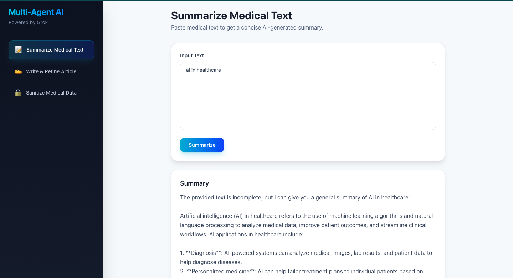

# Multi-Agent AI Healthcare



A powerful **multi-agent AI system** for healthcare text processing — summarization, research article writing, and PHI sanitization. Built with a **React + Tailwind CSS** frontend and a **Flask REST API** backend, powered by **Groq's fast LLM inference** (llama-3.3-70b-versatile).

---

## Table of Contents

- [Overview](#overview)
- [Architecture](#architecture)
- [Features](#features)
- [Tech Stack](#tech-stack)
- [Project Structure](#project-structure)
- [Prerequisites](#prerequisites)
- [Local Setup](#local-setup)
  - [Backend Setup](#1-backend-setup)
  - [Frontend Setup](#2-frontend-setup)
  - [Running Locally](#3-running-locally)
- [Deployment on Render](#deployment-on-render)
- [API Endpoints](#api-endpoints)
- [Agents](#agents)
- [Environment Variables](#environment-variables)
- [Troubleshooting](#troubleshooting)
- [Contributing](#contributing)
- [License](#license)

---

## Overview

The **Multi-Agent AI Healthcare** system demonstrates how to build a production-ready multi-agent AI application **without orchestration frameworks** like Crew AI, AutoGen, or LangGraph. Each agent is a standalone Python class that calls the Groq API, coordinated by a central Agent Manager.

### Key Highlights

- **7 specialized agents** working together in a pipeline
- **Validator agents** ensure output quality for every task
- **Retry logic** with exponential backoff for API resilience
- **Production-ready** — deployable on Render with one click
- **Modern UI** — responsive React design with dark gradient sidebar

---

## Architecture

```
+-------------------+       +-------------------+
|                   |       |                   |
|   Browser         |       |   Render.com      |
|   (React App)     | ----> |   (Flask API)     |
|   :5173 / :80     |       |   :5000 / :443    |
|                   |       |                   |
+-------------------+       +---------+---------+
                                      |
                                      v
                            +---------+---------+
                            |                   |
                            |   Agent Manager   |
                            |   (Python)        |
                            |                   |
                            +----+----+----+----+
                                 |    |    |
                    +------------+    |    +------------+
                    |                 |                 |
                    v                 v                 v
          +---------+-------+  +-----+---------+  +----+---------+
          |                  |  |               |  |              |
          |  Summarize       |  |  Write        |  |  Sanitize    |
          |  Agent           |  |  Article      |  |  Data Agent  |
          |  + Validator     |  |  Agent        |  |  + Validator |
          |                  |  |  + Refiner    |  |              |
          +------------------+  |  + Validator  |  +--------------+
                               |               |
                               +-------+-------+
                                       |
                                       v
                            +----------+---------+
                            |                    |
                            |  Groq API          |
                            |  (llama-3.3-70b)   |
                            |                    |
                            +--------------------+
```

### Data Flow

1. **User** interacts with the React UI in their browser
2. **React** sends HTTP requests to the Flask API (`/api/*`)
3. **Flask** delegates tasks to the appropriate agent via the Agent Manager
4. **Agent** calls the Groq API with task-specific prompts
5. **Response** flows back: Groq → Agent → Flask → React → User
6. **Validator agents** run alongside to verify output quality

---

## Features

### 1. Summarize Medical Texts
- Input lengthy medical documents
- Get concise, accurate AI-generated summaries
- Validator ensures key points are preserved

### 2. Write & Refine Research Articles
- Provide a topic and optional outline
- AI generates a complete research article draft
- Refiner agent enhances clarity, coherence, and academic quality
- Validator rates the final article (1–5 scale)

### 3. Sanitize PHI Data
- Paste medical data containing Protected Health Information
- AI identifies and removes PHI (names, SSNs, DOBs, etc.)
- Validator checks for any remaining PHI
- Production-ready for HIPAA-sensitive workflows

### 4. Quality Validation
Every primary agent has a paired validator agent that:
- Analyzes the output for accuracy and completeness
- Provides detailed feedback
- Rates quality on a 1–5 scale

### 5. Robust Logging
- All interactions logged via Loguru
- Debug-level message inspection
- Logs stored in `logs/multi_agent_system.log`

---

## Tech Stack

| Layer | Technology | Purpose |
|---|---|---|
| **Frontend** | React 19 | UI framework |
| | Vite 8 | Build tool |
| | Tailwind CSS v4 | Styling |
| **Backend** | Flask 3 | REST API server |
| | Flask-CORS | Cross-origin support |
| **AI** | Groq API | LLM inference (llama-3.3-70b-versatile) |
| | OpenAI SDK v2 | Python client for Groq (OpenAI-compatible) |
| **Infrastructure** | Render | Cloud hosting |
| | python-dotenv | Environment variable management |
| | Loguru | Logging |

---

## Project Structure

```
Multi-Agent_Ai_Heathcare/
├── agents/                      # AI agent modules
│   ├── __init__.py              # Agent registry & AgentManager
│   ├── agent_base.py            # Base class with Groq API client
│   ├── summarize_tool.py        # Medical text summarization
│   ├── summarize_validator_agent.py
│   ├── write_article_tool.py    # Research article drafting
│   ├── write_article_validator_agent.py
│   ├── sanitize_data_tool.py    # PHI removal
│   ├── sanitize_data_validator_agent.py
│   ├── refiner_agent.py         # Article refinement
│   └── validator_agent.py       # Article validation
├── backend/
│   ├── app.py                   # Flask API server
│   └── requirements.txt         # Python dependencies
├── frontend/
│   ├── src/
│   │   ├── components/
│   │   │   ├── Sidebar.jsx           # Navigation sidebar
│   │   │   ├── SummarizeSection.jsx   # Summarize UI
│   │   │   ├── WriteArticleSection.jsx # Write article UI
│   │   │   └── SanitizeDataSection.jsx # Sanitize UI
│   │   ├── services/
│   │   │   └── api.js            # API client
│   │   ├── App.jsx              # Main app layout
│   │   ├── main.jsx             # Entry point
│   │   └── index.css            # Tailwind imports
│   ├── package.json
│   └── vite.config.js           # Vite config with API proxy
├── utils/
│   └── logger.py                # Loguru configuration
├── logs/                        # Application logs
├── app.py                       # Root entry point (for Render)
├── requirements.txt             # Root Python deps (for Render)
├── render.yaml                  # Render Blueprint config
├── .env.example                 # Environment variable template
├── .gitignore
└── README.md
```

---

## Prerequisites

| Dependency | Version | Installation |
|---|---|---|
| **Python** | 3.8+ | [python.org](https://python.org) |
| **Node.js** | 18+ | [nodejs.org](https://nodejs.org) |
| **npm** | 9+ | Ships with Node.js |
| **Groq API Key** | — | [console.groq.com](https://console.groq.com) |

---

## Local Setup

### 1. Backend Setup

```bash
# Clone the repository
git clone https://github.com/Vinaymahto808/Multi-Agent_Ai_Heathcare.git
cd Multi-Agent_Ai_Heathcare

# Create and activate a virtual environment
python3 -m venv venv
source venv/bin/activate      # On Windows: venv\Scripts\activate

# Install Python dependencies
pip install -r backend/requirements.txt
```

### 2. Frontend Setup

```bash
cd frontend
npm install
```

### 3. Environment Variables

Create a `.env` file in the project root:

```dotenv
GROQ_API_KEY=gsk_your_groq_api_key_here
```

### 4. Running Locally

**Terminal 1 — Backend:**

```bash
cd backend
python app.py
```

The Flask server starts at `http://localhost:5000`.

**Terminal 2 — Frontend:**

```bash
cd frontend
npm run dev
```

The Vite dev server starts at `http://localhost:5173`.

Open `http://localhost:5173` in your browser. The Vite dev server proxies `/api` requests to the Flask backend.

---

## Deployment on Render

### Prerequisites

- GitHub account connected to Render
- Groq API key ready

### Steps

1. **Push your code to GitHub**
   ```bash
   git add .
   git commit -m "Initial commit"
   git push origin main
   ```

2. **Deploy on Render**
   - Go to [dashboard.render.com](https://dashboard.render.com)
   - Click **New +** → **Blueprint**
   - Select your repository
   - Render auto-detects `render.yaml`

3. **Set environment variables**
   - In the Render dashboard, go to your service → **Environment**
   - Add `GROQ_API_KEY` with your key
   - Click **Save Changes**

4. **Deploy**
   - Click **Manual Deploy** → **Clear build cache & deploy**
   - Render will:
     - Install Python dependencies
     - Build the React frontend
     - Start the Flask server

5. **Access your app**
   - URL: `https://multi-agent-ai-healthcare.onrender.com`

### render.yaml Reference

```yaml
services:
  - type: web
    name: multi-agent-ai-healthcare
    runtime: python
    buildCommand: |
      pip install -r requirements.txt
      cd frontend && npm install && npm run build
    startCommand: python app.py
    envVars:
      - key: GROQ_API_KEY
        sync: false
      - key: FLASK_ENV
        value: production
```

---

## API Endpoints

### Health Check

```
GET /api/health
```

Response: `{ "status": "ok" }`

### Summarize Medical Text

```
POST /api/summarize
Content-Type: application/json

{
  "text": "Patient presents with chest pain and shortness of breath..."
}
```

Response: `{ "summary": "..." }`

### Write & Refine Research Article

```
POST /api/write-article
Content-Type: application/json

{
  "topic": "The impact of AI on healthcare diagnostics",
  "outline": "Optional outline text"
}
```

Response:
```json
{
  "draft": "...",
  "refined": "..."
}
```

### Sanitize Medical Data

```
POST /api/sanitize
Content-Type: application/json

{
  "data": "Patient John Doe, SSN: 123-45-6789, DOB: 01/01/1990..."
}
```

Response: `{ "sanitized": "..." }`

---

## Agents

### Main Agents

| Agent | File | Function | Parameters |
|---|---|---|---|
| SummarizeTool | `summarize_tool.py` | Generates concise summaries | `text` |
| WriteArticleTool | `write_article_tool.py` | Creates research article drafts | `topic`, `outline` (optional) |
| SanitizeDataTool | `sanitize_data_tool.py` | Removes PHI from data | `medical_data` |

### Validator Agents

| Agent | File | Function | Parameters |
|---|---|---|---|
| SummarizeValidatorAgent | `summarize_validator_agent.py` | Validates summary quality | `original_text`, `summary` |
| WriteArticleValidatorAgent | `write_article_validator_agent.py` | Validates article quality | `topic`, `article` |
| SanitizeDataValidatorAgent | `sanitize_data_validator_agent.py` | Verifies PHI removal | `original_data`, `sanitized_data` |

### Refinement Agents

| Agent | File | Function | Parameters |
|---|---|---|---|
| RefinerAgent | `refiner_agent.py` | Enhances article clarity | `draft` |
| ValidatorAgent | `validator_agent.py` | Validates refined articles | `topic`, `article` |

### Agent Configuration

All agents extend `AgentBase` (`agent_base.py`) which provides:
- **Groq API client** pre-configured with the correct endpoint and API key
- **Retry logic** — configurable max_retries (default: 2)
- **Logging** — debug-level message inspection via Loguru
- **Temperature & token control** — per-agent tuning

| Agent | Temperature | Max Tokens | Max Retries |
|---|---|---|---|
| SummarizeTool | 0.7 | 300 | 3 |
| SummarizeValidator | 0.7 | 512 | 2 |
| WriteArticleTool | 0.7 | 1000 | 3 |
| WriteArticleValidator | 0.7 | 512 | 2 |
| SanitizeDataTool | 0.7 | 500 | 3 |
| SanitizeDataValidator | 0.7 | 512 | 2 |
| RefinerAgent | 0.5 | 2048 | 2 |
| ValidatorAgent | 0.3 | 500 | 2 |

---

## Environment Variables

| Variable | Required | Description | Default |
|---|---|---|---|
| `GROQ_API_KEY` | Yes | Your Groq API key | — |
| `FLASK_ENV` | No | Set to `production` for production | `development` |
| `PORT` | No | Server port | `5000` |

---

## Troubleshooting

### "Missing credentials" error

```
openai.OpenAIError: Missing credentials...
```

**Fix:** Ensure `GROQ_API_KEY` is set in your `.env` file (local) or Render Environment Variables (production).

### "Model not found" error

```
Model not found: llama3-8b-8192
```

**Fix:** The model has been decommissioned. Update to a supported model like `llama-3.3-70b-versatile` in `agents/agent_base.py`.

### 404 errors on Render

```
Running 'app.py'
bash: line 1: app.py: command not found
```

**Fix:** Ensure you have a root-level `app.py` that imports from `backend.app` and `render.yaml` with the correct start command:

```yaml
startCommand: python app.py
```

### Frontend not loading

If the Flask API works but the UI doesn't load, rebuild the frontend:

```bash
cd frontend
npm run build
```

The built files should be in `frontend/dist/` and Flask serves them automatically.

### CORS errors in browser

The Vite dev server proxies API requests. For production, CORS is handled by `flask-cors`. Ensure:

1. In `vite.config.js`: `server.proxy` points to the backend URL
2. In `backend/app.py`: `CORS(app)` is present

---

## Contributing

Contributions are welcome! Please follow these steps:

1. **Fork the Repository**
2. **Create a Feature Branch**
   ```bash
   git checkout -b feature/YourFeature
   ```
3. **Commit Your Changes**
   ```bash
   git commit -m "Add your feature"
   ```
4. **Push to the Branch**
   ```bash
   git push origin feature/YourFeature
   ```
5. **Open a Pull Request**

---

## License

This project is licensed under the **MIT License**.

---

## Acknowledgements

- [Groq](https://groq.com) — Fast LLM inference API
- [OpenAI Python SDK](https://github.com/openai/openai-python) — OpenAI-compatible client for Groq
- [Flask](https://flask.palletsprojects.com/) — Python web framework
- [React](https://react.dev/) — Frontend UI library
- [Vite](https://vitejs.dev/) — Frontend build tool
- [Tailwind CSS](https://tailwindcss.com/) — Utility-first CSS framework
- [Loguru](https://github.com/Delgan/loguru) — Python logging library
- [Render](https://render.com) — Cloud hosting platform
- [python-dotenv](https://github.com/theskumar/python-dotenv) — Environment variable management
